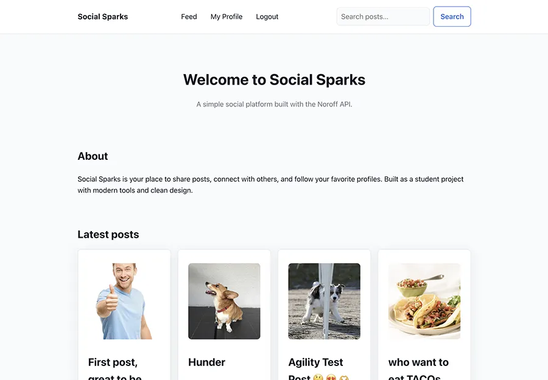

# Social Sparks



A mini social network / micro-blogging app where users can register, log in, browse the feed, create/edit/delete their own posts, follow/unfollow, react with emojis, and comment. Built with Vite and vanilla JavaScript (ES modules).

## 🔗 Links
- **Live Site:** https://katjaturnsek.github.io/social-sparks/
- **Repo:** https://github.com/KatjaTurnsek/social-sparks
- **Project Kanban:** https://github.com/users/KatjaTurnsek/projects/2/views/1
- **API Docs:** https://docs.noroff.dev/docs/v2

## ✅ Features (per brief)
- Register & Login (Noroff Auth)
- Feed & single post
- Create / Edit / Delete own posts
- Comments & emoji reactions
- Profiles: posts, followers, following
- Follow / Unfollow users
- Search posts

## 🔧 Built With
- Vite (multi-page build via `vite.config.js`)
- JavaScript (ES Modules) with `// @ts-check` + JSDoc
- HTML5, CSS3
- Noroff API v2 (Auth + Social)

## 📄 Pages
`index.html`, `login.html`, `register.html`, `feed.html`, `post.html`,  
`profile.html`, `search.html`, `create-post.html`, `edit-post.html`, `edit-profile.html`

## 🧩 How This Meets the Brief
- ES6 modules throughout
- JSDoc added to key functions (`// @ts-check` across modules)
- Deployed on GitHub Pages
- Basic, accessible UI (cards, grid, forms, skip link, ARIA live regions)

## 🔧 Getting Started (Local)
```bash
git clone https://github.com/KatjaTurnsek/social-sparks.git
cd social-sparks
npm install
npm run dev
```

## 🏗️ Build & Deploy
Outputs to /docs (configured for GitHub Pages):
```bash
npm run build
```
Commit & push; GitHub Pages serves from main → /docs.

## ⚙️ Configuration
Defaults to https://v2.api.noroff.dev. Optional .env:
```dotenv
VITE_API_BASE="https://v2.api.noroff.dev"
```
## 📁 Structure (excerpt)
```text
social-sparks/
├─ assets/
│  └─ images/
├─ src/
│  ├─ css/
│  └─ js/
│     ├─ boot.js  utils.js  types.js
│     ├─ shared/ (auth.js, dates.js, dom.js, errors.js)
│     └─ pages/
│        index.js  login.js  register.js  feed.js
│        post.js   profile.js  search.js
│        create-post.js  edit-post.js  edit-profile.js
├─ index.html  login.html  register.html  feed.html
├─ post.html   profile.html  search.html
├─ create-post.html  edit-post.html  edit-profile.html
├─ vite.config.js
└─ package.json
```

## ♿ Accessibility & Performance
Semantic HTML, visible focus, ARIA live regions, lazy-loaded images, skeleton loaders.

## 🙋‍♀️ Author

** Katja Turnšek **
Frontend Development Student
[Portfolio Website](https://katjaturnsek.github.io/portfolio/) (coming soon)


